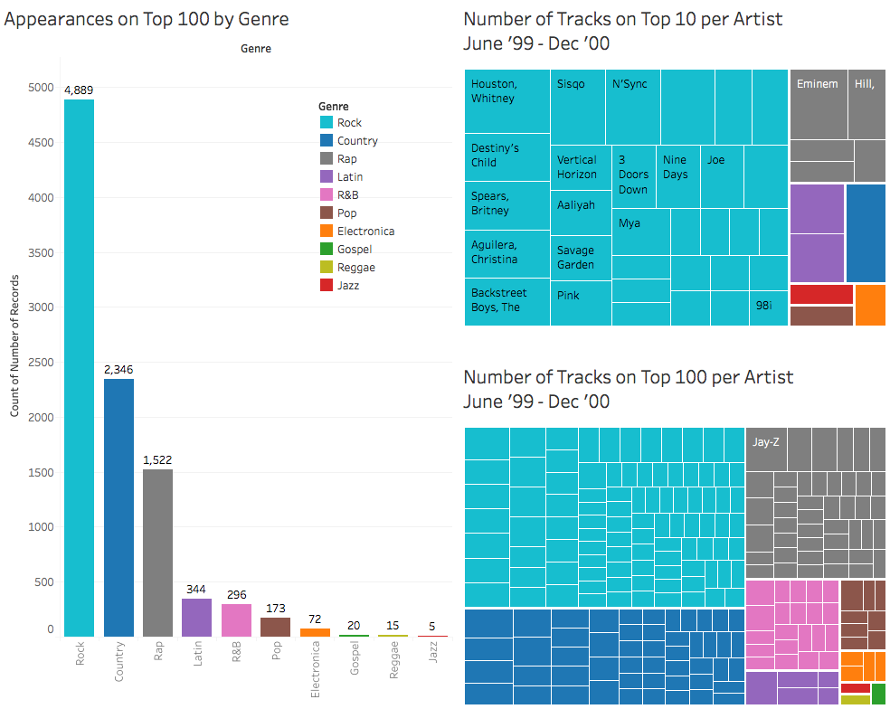
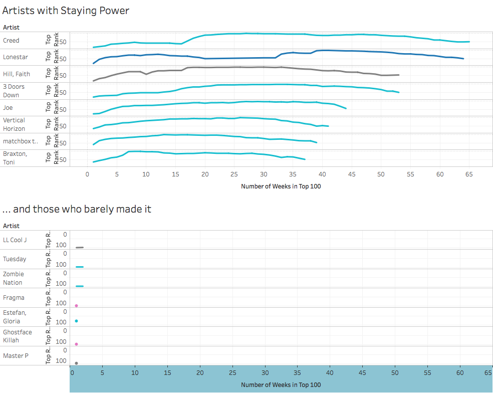
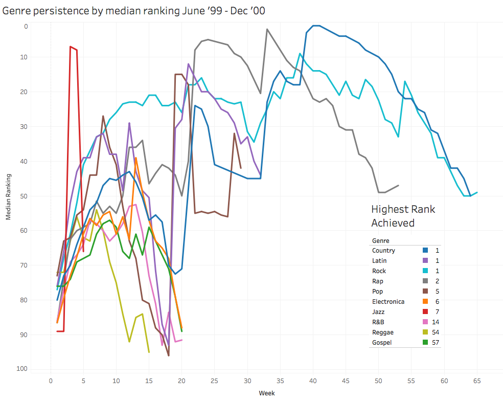

### A Data Science project

#### Week 2 of the Data Science Immersive programme

### So what are we looking at here?

The [dataset](../datasets/billboard.csv) we’re dealing with contains __Top 100 chart ranking__ data on 317 songs from the period of June 1999 to December 2000 spanning 76 weeks. In addition to basic information about each song such as its artist, track name, song length and genre, the dataset also tracks chart position over time measured in units of weeks, including when it entered the chart and the time of peaking.

There are a large number of NaNs in the weekly chart ranking columns. It can be reasonable assumed that it indicates a song falling out of Top 100. These NaNs will have to be suitably handled during data cleaning.

Furthermore, this table is very wide due to the way it organises the weekly rank information by column. The use of pivot tables and melting will be useful for consolidating that information.

### Problem Statement

#### 1. Were the songs in the Top 100 chart dominated by a few artists in '99-'00?

The rationale behind posing this question can be summed up as follows:

- The music industry has to devote resources and manpower to promote artists and songs.
- If Top 100 chart songs are dominated by a few artists, the industry can pour resources into just a handful of them to maximize their audience, and by extension their economic return.
- Conversely, if the statement were proven to not be true, then industry leaders should focus instead on casting a wide net in order to capture a greater variety of artists that appeal to more people.
- The above logic applies equally to genres as to artists: if certain genres have an outsize popularity as reflected by the charts, then more effort should be put into promoting artists who create that genre of music.

#### 2. Follow-up: Does that hold true today?

The follow-up question is outside the scope of this exercise, but for future follow-up work, answering this second and more relevant question will allow us to see if the distributions of song/artist popularity and chart persistence have changed. The results of this investigation can potentially be very revealing, because a number of trends in the years between the dataset timeframe of 1999 - 2000 and the present day of 2016 have changed the music landscape beyond recognition:

- The advent of Ipods, then smartphones
- The explosive popularity of Youtube and music streaming services
- Fall-off in popularity of traditional media, e.g. CDs, radio, TV
- Shift from traditional to digital marketing

As the underlying factors that influence music production, promotion and consumption change, it would be interesting to see if these have led to a change in the distribution of songs, artists and genres in the Top 100, not only for prosaic academical reasons, but more importantly for market research purposes that players in the music industry today will no doubt be keeping an eye on.

### Approaching the problem

We can approach problem statement 1 by looking at __artist popularity__ in a number of different ways, mainly by investigating the distribution of:

1. number of songs by artist that appeared in the Top 100
2. ranking achieved by these songs
3. persistence in the charts

Data visualisation is essential to see if any of the three elements are affected by outsize influences of a small number of artists, or not. For item 1, a __treemap__ can be very useful because it displays interval measurements well by linking the area of blocks with the magnitude of measurements.

Regarding item 2, a full investigation can involve following individual song ranks or artist's songs ranks, with the latter being additionally characterisable by highest rank, lowest rank, median rank, standard deviation and other statistical measures for a grouping of songs. A simple table with __coloured-in cells for heat values__ can be an effective visualisation tool for simple measures of rank, and perhaps candlestick charts for better visualisation of data distribution.

To tackle item 3, we can track chart persistence by visualising changes in rank over time. Plotting a __time series__ line chart of median rank can be an effective means to screen out extreme outliers in ranking; though it is arguably more important to look at top ranks, because those are likely to be the greatest drivers of revenue. An additional tool can again be candlestick charts to visualise the distribution of ranks.

Looking at __genre popularity__ is just as important, for which the above methods apply, but generalised to an entire genre of music as opposed to just one artist.

### Data Munging

The following code block simplifies column names:

	# building dictionary for renaming columns
	rename = {'artist.inverted':'artist'}
	for i in dataset.columns:
	    if 'week' in i:
		if len(i) == 9:
		    new = int(i[1:2])
		else:
		    new = int(i[1:3])
    	    rename.setdefault(i,new)

	# renaming columns in place
	dataset.rename(columns=rename,inplace=True) 

Here the rank values are converted from __floats to integers__:

	# converting NaN rank numbers to 101
	dataset.fillna(value = 101, inplace=True)
	# converting float rank numbers to integers
	dataset.iloc[:,7:]= dataset.iloc[:,7:].applymap(lambda x: int(x))

The above code converts the __NaN rankings to 101__ to indicate that the song has fallen off the top 100.

Below, the columns 'year', 'time', 'date.entered' and 'date.peaked' are __converted to datetime__:

	from datetime import datetime
	for col in ['year','time','date.entered','date.peaked']:
  	  pd.to_datetime(dataset[col])

Using Pandas' built in `melt` function, pivot the weekly ranking data to be long rather than wide. As a result, you will have removed the 72 'week' columns and replace it with two: Week and Ranking. There will now be multiple entries for each song, one for each week on the Billboard rankings.

	weeklist = list(dataset.columns[7:])
	melted = pd.melt(dataset, id_vars=['artist', 'track'],
       	var_name="Week", value_name="Ranking",
       	value_vars = weeklist)
	pivoted = pd.pivot_table(melted, index = ['artist','track', 'Week'])

### Data Visualisation

The cleaned DataFrame and the melted pivot table from the last code block were loaded into __Tableau__ for data visualisation. The follow charts and descriptions group together visualisations and observations based around __three themes__:

#### 1. Top Genres

Based on the histogram on the left of number of appearances on Top 100 by genre, a __Pareto-like distribution__ of popularity emerges as divided by genre, with 3 most popular genres:

1. Rock
2. Country
3. Rap

Looking to the treemaps on the right, although the above genres clearly dominate, the number of songs per artist that made it into Top 10 and Top 100 seems to be much more evenly distributed. __Most artists only had one Top 100 song__, and even the most prolific and popular artists have __at most five songs in Top 100__. 

Note also that while Latin (in purple) is not in the top 3 most popular genres, it has an outsize influence in terms of number of Top 10 tracks as shown in the upper right hand chart, coming in just behind Rock and Rap and ahead of Country.

#### 2. Long-lasting artists

An interesting feature of this dataset is that we can extract information to find out how long individual artists stayed in the Top 100 chart_. While no artist was able to remain in Top 100 for the entire duration of 76 weeks, a handful shown in the top chart lasted more than 35 weeks, with Creed topping out in terms of __chart persistence__ with 65 weeks in the Top 100 before falling off. By contrast, at the bottom rung there were artists who only appeared on the list for one week. 

Also noteworthy is that, comparing with the first chart shown, __the set of artists who have longest chart persistence do not overlap significantly with those who created the most Top 10 songs__.

#### 3. How genres fared over time

The above graph uses __median chart rankings of a genre__ to show the general trends of individual genres over time. We can look at two parameters:

1. How long individual genres lasted; and
2. How high in the rankings they climbed

Looking at the colour-coded curves by genre, we see that Country, Rock and Rap persisted the longest in charts, which is the same set of genres that were the three most popular seen in the very first graph. The median rankings of these same genres also each broke into Top 10 at one point or another, but of the three Rap only made it to the 2nd place, as shown by the table in the bottom left, while the other 2 both reach the number one spot.

We can also see that a number of genres did not last long, falling off at fewer than 20 weeks:

- Electronica
- __Jazz (red)__
- Gospel
- R&B
- Reggae

These genres also failed to break into Top 10, with the very significant exception of Jazz, which spiked up in its third week but quickly fell off the chart altogether by its sixth week since entering the chart. Pairing this observation with the fact that Jazz only appeared on the charts 5 times throughout the entire period covered by this dataset, as shown by the first chart, indicates that while Jazz rarely appeared in the Top 100, when it did it went straight up to the top, reaching number 7 before falling back to obscurity in the space of a month.

One last feature of the line chart bears mentioning: __the bottom right hand corner is empty space__. You can imagine this area being bounded roughly by the two lines Median Ranking = 50 in the y-axis and Week = 30 in the x-axis. What this tells us is that for this dataset:

- Once a song has been in the charts for more than 30 weeks, when it falls out of the top 50 it generally disappears off the Top 100 altogether.

### Conclusions

placeholder text

